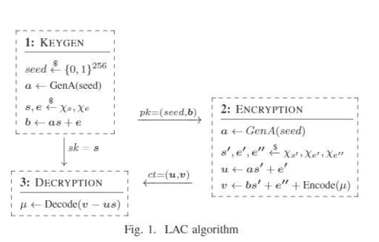

# Contexte 

le modèle de chiffrement actuel, basé sur les clé publiques *RSA* est très vulnérable aux attaques par 
*ordinateurs quaniques*. il est donc nécessaire de trouver un autre modèle car lagrande majorité des chriffrements utilisés aujourd'hui sont basés sur la méthode RSA.  
RSA se base sur la résolution de problèmes mathématiques très complexes, ne pouvant pas être résolus par des ordinateurs classiques en un temps polynomial. Un ordinateur quantique de *grande taille*, en revanche, serait capable de résoudre ces problèmes en temps résonables.  

*LAC* est une méthode utilisant toujours les clés publiques mais résistants aux attaques quantiques. *Lattice based*. Dit "*Ring Learning With Errors, RLWE*. Considéré *efficace energétiquement ET en terme de mémoire en standard NIST*.  
Clé relativement petite, et arithmétique simple. 
 *  code *BCH* qui permet d'utiliser des nombre polynomiaux avec un *coeff a un seul octet*
 *  Méthode remplacant les mult par des add/sub  : polynomes d'erreurs a *coeff ternaires*
Le but est ici de proposer une implémentation d'une architecture codesign HW/SW  de cryptographie LAC.  
Deux choses proposées :  
HW accel pour LAC et leurs bottlenecks (génération de nb polynomiaux, multiplication de ces derniers et *correction d'erreurs*) (128/256b)
Création d'une extension RISC-V LAC et intégration des accelzerateurs dans un core RISCV  
Choix RISCV : extensible, gratuit, *securisé*. Implémentation dans le pipeline directement pour diminuer les couts de communication bus.

Augmentation de la taille ( *importante ?*) : 32K LUT, 11K registres et 2 slice DSP (*c'est l'augmentation ou le total ?*)

Quelques implémentations sous x86, arm et RISCV mais pas de résultats de perf, et peu d'utilisation de codesign. Intégration faible a l'ISA

# LAC post quantique
## Le problème RLWE 
deux problèmes en un :
* problème de recherche : trouver _s_ dans l'équatrion _b = a.s + e_ en conaissant le polynome _a_ (public) et le résultat _b_.   
_s_ est le coefficient polynomial secret, et _e_ est le coefficient de correction d'erreur spécifique a _a_
* problème de décision : *disntinguer le couple (a, b) d'un "uniform sample"*

## Etape 1 : génération de clés
Obtention de la clé publique _pk_ à partir d'un couple _(graine, b)_ et de la clé secrète _sk_ valant _s_
Utilisation de sha256 pour obtention d'un nombre pseudo aléatoire pour *étendre* une graine  
_s_ et _e_ sont obtenus à l'aide d'une distribution binomiale
<!-->TODO do a fuck ton more reseach <!-->

## Etape 2 : Chiffrement
<!-->TODO huh ? <!-->
Ajout de bruit _u_ via une instance RLWE ?
## Etape 3 : Déchiffrement
Utilisation de la clé privée _sk_ pour retrouver la chaine de caractère initiale en soustrayant le terme _u.s_ de _v_ afin de filtrer les plus gros termes parasites. Le reste est retiré à l'aide d'un *BCH decoder*

# Accélération HW
## problème de la ganération de polynomes
Utilisation d'un accelerateur SHA256. *Voire référence 7*.

## problème de la multiplication de polynomes

LAC est basé sur ce type d'opération, a la fois pour créer des "instances RLWE" au chiffrement, et au déchiffrement.
Principe : remplacer les multiplciations par des additions et soustractions, des opérations beaucoup plus simples à faire sur des polynomes
